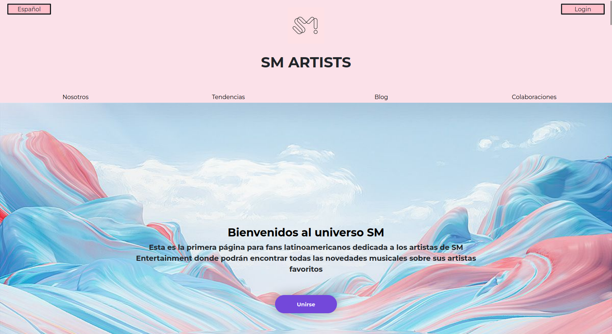
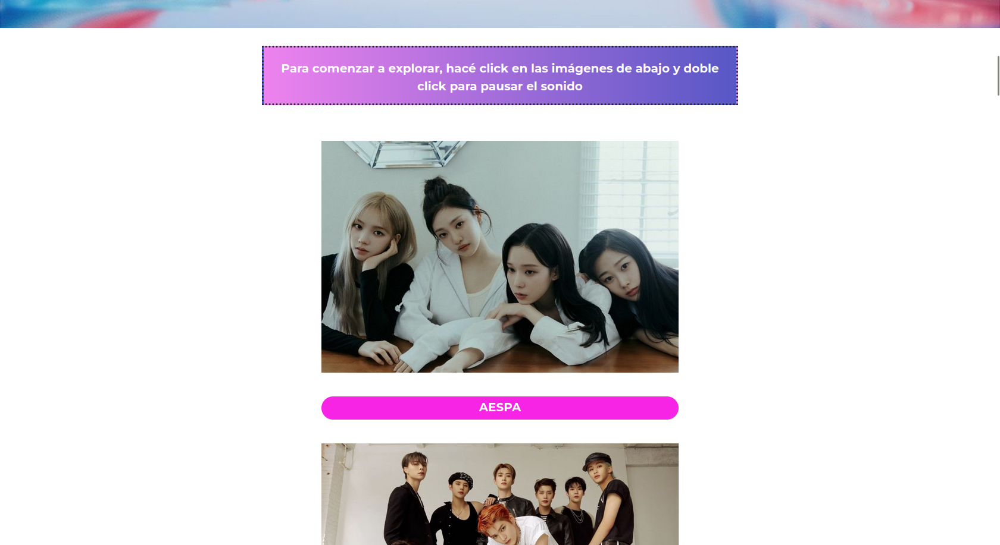

# SM Artists guía
***

***
Este proyecto surge  principalmente a partir de una consigna para un trabajo para el programa de BA Multiplica 2.0 y en consecuencia como una idea para crear una guía que permita a fanáticos de Kpop de Latinoamérica, tanto hablantes de español como de portugés, acceder a novedades sobre la música y otros trabajos de los artistas de la empresa surcoreana SM Entertainment. 

Como la empresa no posee una página dedicada única y específicamente a sus artistas musicales pensé en crear una.

Además, dado que los contenidos de esta empresa no tienen una gran promoción en este lado del mundo, considero que es útil tener una guía que sirva tanto para fans antiguos como para fans nuevos. 
Por otro lado, la página esta pensada para que sea simple e interactiva y facilitar la interacción con el usuario. 

***
### Pre-requisitos 📋
Para poder visualizar y navegar en la página sólo es necesario poseer instalados browsers o navegadores como Google Chrome, Firefox o Safari.

***
## Construido con 🛠️
* HTML
* CSS
* Javascript
***
## Estado-del-proyecto 
:construction: Proyecto en construcción :construction:
La página se encuentra aun en desarrollo, ya que hay algunas funciones que no he logrado poner en marcha por limitaciones en mis conocimientos y algunos errores de responsividad en dispositivos móviles. 
***
## Link al proyecto
https://github.com/claralunar/Proyecto_SM_Artists_BA-Multiplica
***
## Link al deploy
https://claralunar.github.io/Proyecto_SM_Artists_BA-Multiplica/
***
## Instrucciones
* Página principal
En primer lugar nos encontramos con la página principal, la cual da la bienvenida al usuario e inmediatamente lo invita a subscrirse con su dirección de correo para recibir las novedades, haciendo click en el botón violeta ubicado en el hero.

De los botones ubicados en el header idealmente, el botón _Español_ es para cambiar el idioma de la página y el de _Login_ es para que  el usuario ingrese cuando ya está registrado. Se usará más adelante. 

Al desplazarse hacia abajo encontramos las distintas imagenes de los distintos artistas en las cuales el usuario puede clickear para comenzar a escuchar música y hacer doble click para pausar. Me pareció oportuno colocar una canción por artista sobre todo pensando en los fans nuevos que quizás conocen poco o nada, antes de subscribirse o explorar más sobre los artistas. Sin dudas, es la sección más interactiva de la página por el momento.

En caso de querer investigar más, el usuario puede hacer click en los botones con los nombres de los artistas debajo de los imágenes para explorar. _En este caso, sólo el primer nombre lleva a una página nueva, a modo de ejemplo_

Para refrescar la página sólo hay que hacer click en el logo ubicado en el header.

* Luego, en el navegador se observan varias secciones que involucrarán al usuario. 
La seccion _Nosotros_ es simplemente un presentación que termina de cerrar la idea de la página. Nuevamente, para volver a la página principal hacer click en el logo del header. 

* La sección _Tendencias_ está inactiva por el momento, pero idealmente podría incluirse una API que permita mostrar automáticamente las noticias o novedades de cada artista. Para futuras investigaciones...

* La seccion _Blog_ es un espacio que sirve para que los usuarios puedan leer diversas opiniones, comentarios, reseñas curiosidades que van más allá de las novedades o noticias. Estas publicaciones pueden ser escritas tanto por los administradores como por colaboradores externos, subscriptos o no. 

* La sección _Colaboraciones_ es donde quienes quieran contribuir a la sección de Blog podrán ponerse en contacto con los administradores y expresar su interés por publicar llenando sus datos en el formulario, siempre sujeto a la consideración de los administradores. A partir de allí, las comunicaciones se harán a través de la casilla de mail y si son aceptados o no, se les prooverá de un nombre de usuario y contraseña que utilizarán para loguearse  en la página. La idea es que tanto fans más antiguos como los más recientes puedan interactuar proveyendo información pertinente e interactuando con likes o posiblemente con comentarios.
***
## Agradecimientos

A la gente del programa BA Multiplica 2.0 y a nuestro profesor Martín Suárez por toda la información y el conocimiento que nos brindaron, por la paciencia y por darnos la oportunidad de ser creativos.

